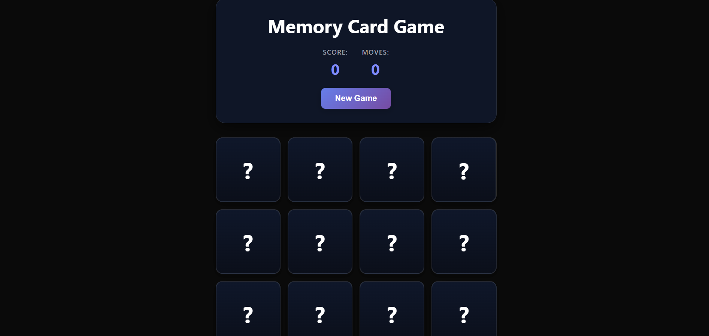

# 🧠 Memory Card Game

A fun and interactive memory matching game built with **React** and **Vite**.

Test your memory by flipping cards and finding matching pairs. Every correct match rewards you with a satisfying sound effect, while incorrect guesses trigger a playful "faahh" sound. Complete the board with the highest score and the fewest moves possible!

---

## 🎮 Live Demo

👉 Play the game here: https://elaborate-tiramisu-67c899.netlify.app

👉 View the source code: https://github.com/Shabnam-Fatma/memory-game

---

## ✨ Features

* 🎴 Interactive card-flipping gameplay
* 🔀 Randomized card arrangement every new game
* 🔊 Sound effects for game feedback

  * ✅ Match sound for correct pairs
  * ❌ Playful sound for incorrect matches
* 🔄 Unmatched cards automatically flip back
* 📊 Real-time score tracking
* 👣 Move counter
* 🏆 Winning popup displayed when all pairs are matched
* 🔁 Restart and play again anytime
* 📱 Fully responsive design
* ⚡ Fast performance powered by Vite

---

## 📸 Screenshots

### Starting Screen



### Winning Screen


> Create a `screenshots` folder in the root of your project and add your images there.

---

## 🚀 Tech Stack

* React
* Vite
* JavaScript (ES6+)
* HTML5
* CSS3

---

## 📂 Project Structure

```bash
memory-game/
├── public/
│   └── sounds/
│       ├── error.mp3
│       └── match.mp3
├── src/
│   ├── components/
│   │   ├── Card.jsx
│   │   ├── GameHeader.jsx
│   │   └── WinMessage.jsx
│   ├── App.jsx
│   ├── index.css
│   └── main.jsx
├── .gitignore
├── eslint.config.js
├── index.html
├── package.json
├── vite.config.js
└── README.md
```

---

## 🕹️ How to Play

1. Click on any card to reveal it.
2. Click a second card to find its matching pair.
3. If both cards match:

   * The cards stay revealed.
   * Your score increases.
   * A success sound plays.
4. If the cards don't match:

   * A playful error sound plays.
   * The cards flip back automatically.
5. Match all pairs to complete the game.
6. Try to finish with the highest score and the fewest moves.

---

## 📊 Game Metrics

### Score Meter

Earn points by successfully matching card pairs.

### Move Counter

Every pair attempt counts as one move.

### Victory Message

After matching all cards, a popup displays:

* 🎉 Total score achieved
* 👣 Total moves taken

---

## ⚙️ Installation & Setup

Clone the repository:

```bash
git clone https://github.com/Shabnam-Fatma/memory-game.git
```

Navigate to the project directory:

```bash
cd memory-game
```

Install dependencies:

```bash
npm install
```

Start the development server:

```bash
npm run dev
```

Open your browser and visit:

```text
http://localhost:5173
```

---

## 🏗️ Available Scripts

```bash
npm run dev
```

Starts the development server.

```bash
npm run build
```

Builds the application for production.

```bash
npm run preview
```

Previews the production build locally.

---

## 🧩 Components Overview

### `Card.jsx`

Handles:

* Card rendering
* Flip animations
* Match interactions

### `GameHeader.jsx`

Displays:

* Current score
* Total moves
* New game button

### `WinMessage.jsx`

Shows the final results after the player wins.

---

## 🎯 Future Improvements

* ⏱️ Add a timer
* 🏅 High score system using local storage
* 🎚️ Multiple difficulty levels
* 🌙 Dark and light mode toggle
* 🔇 Sound on/off option
* 🎨 Additional card themes
* ✨ Improved animations

---

## 🤝 Contributing

Contributions, suggestions, and improvements are welcome.

1. Fork the project
2. Create your feature branch

```bash
git checkout -b feature/amazing-feature
```

3. Commit your changes

```bash
git commit -m "Add amazing feature"
```

4. Push to the branch

```bash
git push origin feature/amazing-feature
```

5. Open a Pull Request

---

## 👩‍💻 Author

**Shabnam Fatma**

* GitHub: https://github.com/Shabnam-Fatma

If you enjoyed this project, don't forget to ⭐ the repository!

---

## 📄 License

This project is licensed under the MIT License.
